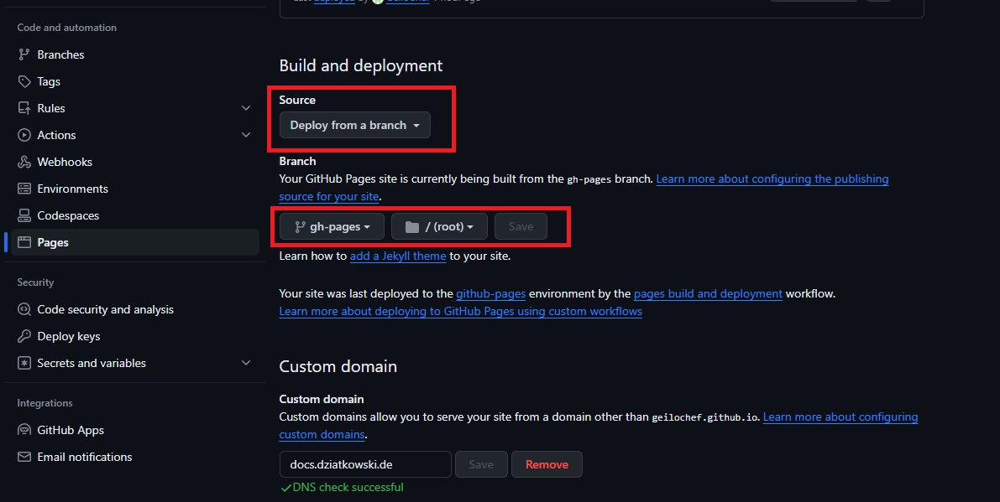
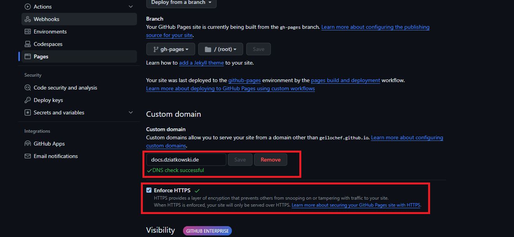

# How to deploy on GitHub Pages

On GitHub pages, you can deploy a static web page for free. This can be fully automated with GitHub actions, if you
are using a free repository.

Follow the following steps to deploy a static web page on GitHub pages.

### 1. Add GitHub action to build the application

You can make use of GitHub actions to automatically re-build your application once you push something to a certain
branch. For this, follow the Guide
[How to build a static webpage with GitHub Pages]('/github-pages/build-static-pages-with-github-actions').

### 2. Setup GitHub pages in the settings of your repository

Before you can deploy your built website with GitHub pages, you need to activate GitHub pages in the settings
of your repository.

1. Select the Source to be `Deploy from a branch`
2. Select the Branch `gh-pages` to be the branch that will be deployed

> After selecting `Deploy from a branch` for the first time it might take some time to do the first run. Only after
> that the branch `gh-pages` is created on your repository, and you can select it in the dropdown.

### 3. How to use you own Domain?

To use your own domain you have to do two things.

#### 3.1 Set up your DNS settings for the Domain you want to use

The following settings are what you need to set in your providers DNS config for your Domain. For a detailed
documentation, follow the steps on the
[Official Documentation]('https://docs.github.com/de/pages/configuring-a-custom-domain-for-your-github-pages-site').

| Host | Type  | Destination         |
|------|-------|---------------------|
| @    | A     | 185.199.108.153     |
| @    | A     | 185.199.109.153     |
| @    | A     | 185.199.110.153     |
| @    | A     | 185.199.111.153     |
| @    | AAAA  | 2606:50c0:8000::153 |
| @    | AAAA  | 2606:50c0:8001::153 |
| @    | AAAA  | 2606:50c0:8002::153 |
| @    | AAAA  | 2606:50c0:8003::153 |
| @    | AAAA  | 2606:50c0:8003::153 |
| www  | CNAME | geilochef.github.io |

> For subdomains, you only have to set the `CNAME`!

| Host | Type  | Destination         |
|------|-------|---------------------|
| docs | CNAME | geilochef.github.io |

#### 3.2 Enter the custom domain in the GitHub pages settings of your repository

Enter the Domain you created the DNS records for into the input field in the settings of your repository, then 
click on "Check DNS Settings". This might take some while and possible will at
first fail. If you set the settings from above, just wait some time and try
again - it will eventually work for sure.

**Last bust not least, tick the checkbox for `Enforce HTTPS` to ensure your
page will only be served over HTTPS**

