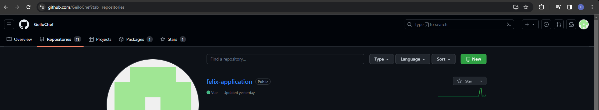
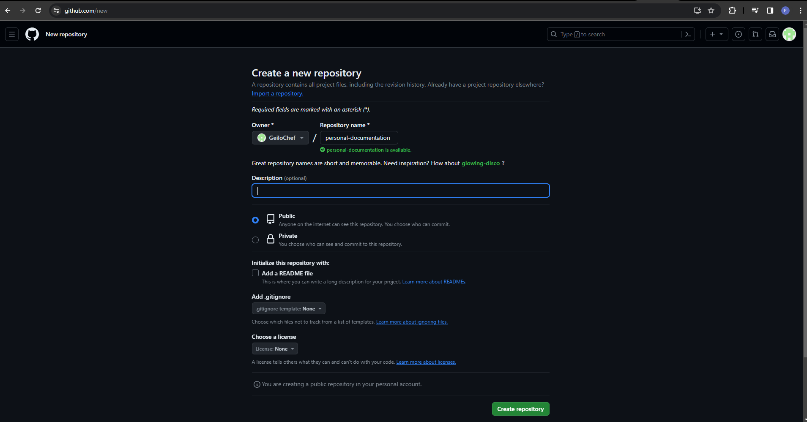

# Create new empty GitHub Repository

## 1. Open the page of your repositories
Go to the [Repository Tab](www.github.com/GeiloChef?tab=repositories) and click on `New` on the top right.

## 2. Add information for your new repository
Enter a repository name and a description if you want. 

**!!Make sure to not tick the checkbox for `Add a README file`!!**

Now you can click on `Create repository` on the bottom right.

___

*:heavy_check_mark: You have now successfully created an empty GitHub.*

